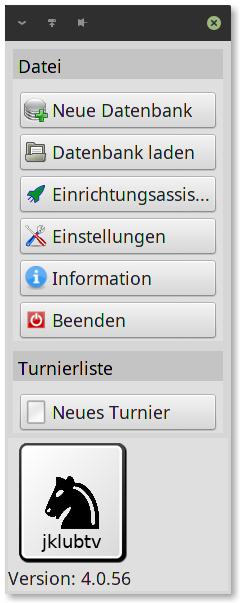

# 5. Schritt
## Erstellen eines Turnieres
Wenn Sie bereits eine Datenbank erstellt haben und die
Spieler, die in ihrem Turnier mitspielen sollen, eingegeben
haben, können Sie ihr Turnier erstellen.
###### Menüpunkt:
**Neues Turnier**

Ein Turnier kann mehrere Gruppen enthalten. Jede Gruppe
des Turnieres enthält die Spieler die im Runden Modus (Jeder
gegen Jeden) gegeneinander spielen.
Es werden beim erstellen des Turnieres mehrere Daten
abgefragt. Z.B. das Start- und Enddatum des Turnieres und
der Name des Turnieres, den Sie sich beliebig ausdenken
können und später beispielsweise auf der Homepage als
Überschrift angezeigt wird.
Auch die Namen für die einzelnen Gruppen werden erfragt.
Als letztes können Sie die einzelnen Spieler aus ihrer
Spielerliste den einzelnen Gruppen hinzufügen.
Nachdem Sie den letzten Spieler hinzugefügt haben und dies
bestätigen, wird das Turnier ertstellt.
Nun können Sie im "Paarungsmodus" noch einige Änderungen
machen, z.B. die Farbverteilung ändern oder Die
Rundennummer verändern und natürlich für jede Paarung das
Datum eingeben.
Nach dem Speichern und Beenden des Paarungsmodus
können Sie nun die Tabellen sehen und eventuell schon die
ersten Punkte verteilen.
Vergessen Sie am Ende der Eingaben nicht zu speichern.
Sie können die Tabellen exportieren in:

- HTML Datei zur Veröffentlichung auf der Vereinsseite
- PDF Datei
- Excel Datei
- Kalender Datei für z.B. Outlook