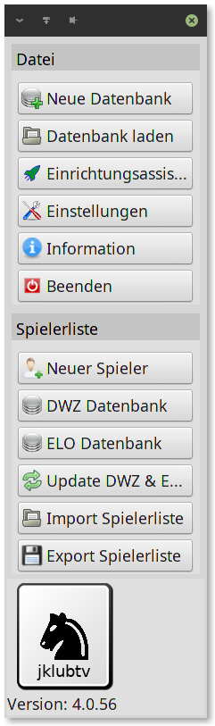

# 4. Schritt
## Erstellen einer Spielerliste
Nachdem Sie eine Datenbank erstellt haben, können Sie nun
die Spieler für ihre Turniere eingeben. Bevor Sie ein Turnier
erstellen, müssen alle Spieler eingegeben werden.
Dies tun Sie im oberen Tab unter
Spielerliste.
Hier haben Sie mehrere Möglichkeiten um Spieler
einzugeben:
1. Spieler aus der DWZ Liste hinzufügen
Wenn Sie Spieler aus der DWZ Liste hinzufügen wollen,
klicken Sie den DWZ Datenbank Button und fügen sie
dort die Spieler hinzu.
2. Spieler aus der ELO Liste hinzufügen
Wenn Sie Spieler aus der ELO Liste hinzufügen wollen,
klicken Sie den ELO Datenbank Button und fügen sie
dort die Spieler hinzu.
3. Spieler manuell hinzufügen
Wenn Sie Spieler manuell hinzufügen wollen, klicken Sie
den Neuer Spieler Button und fügen sie dort die Spieler
hinzu.
Nach der Eingabe aller Spieler können Sie nun ihre Turniere
eingeben.
