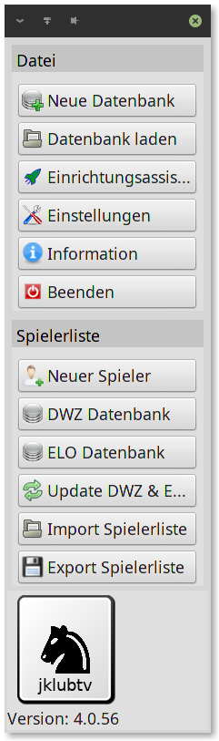

# 3. Schritt
## Erstellen einer neuen Datenbank
In einer Datenbank werden sämtliche eingegebenen Spieler
und Turniere gespeichert. Sie können natürlich beliebig viele
Datenbanken erstellen. Sie können mehrere Turniere in einer
Datenbank speichern, jedoch wird dies bei steigender Anzahl
der Spieler etwas unübersichtlich, deshalb sollte man pro
Datenbank nicht zu viele Turniere speichern.
Anleitung:
###### 1. Datenbank erstellen:
Erstellen Sie eine neue Datenbank
###### Menüpunkt:
| Neue Datenbank |
|--------|
||
|im linken Navigationsfenster| 

